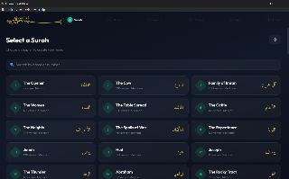
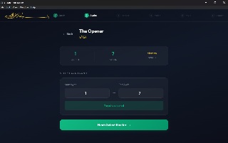
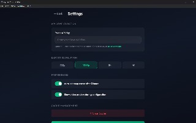

# Quran Short Maker (Desktop App)

Create beautiful short-form videos with Quranic recitations, background videos, and optional Arabic/English subtitles. A privacy-first, serverless desktop application that processes everything on your device.

[](https://github.com/yourusername/quran-shorts-maker/actions/workflows/ci.yml)
[](https://opensource.org/licenses/MIT)

---

## Features

- **All 114 Surahs** — Browse and search the complete Quran
- **Multiple Reciters** — Choose from popular reciters (Alafasy, Sudais, and more)
- **Stock Video Search** — Search Pexels for free stock footage with your own API key
- **Upload Your Own Video** — MP4, MOV, or WEBM
- **Arabic Subtitles** — Proper text shaping and RTL layout (Noto Sans Arabic)
- **English Translation** — Optional English subtitles below Arabic
- **Aspect Ratios** — 9:16 (vertical), 1:1 (square), 4:5 (portrait), 16:9 (landscape)
- **Export Resolution** — 720p, 1080p, 2K, 4K
- **Open in Folder** — One-click to reveal the exported file in Explorer
- **Privacy First** — All processing on-device, no data leaves your device

---

## Screenshots





---

## Quick Start

### Prerequisites

- Node.js 18+
- FFmpeg binaries in `desktop/bin/`

### Installation

```bash
# Clone the repository
git clone https://github.com/yourusername/quran-shorts-maker.git
cd "quran shorts maker"

# Install dependencies
cd shared && npm install && cd ..
cd desktop && npm install && cd ..

# Download FFmpeg binaries
# Place ffmpeg.exe and ffprobe.exe in desktop/bin/

# Download Arabic font
# Place NotoSansArabic-Regular.ttf in desktop/assets/fonts/
```

### Running the App

**Development:**
```bash
cd desktop
npm start
```

**Production build:**
```bash
cd desktop
npm run build
```

---

## Usage

1. **Browse** — Open the app and browse all 114 Surahs, or search by name
2. **Select** — Choose a Surah and Ayah range (up to 20)
3. **Reciter** — Select your preferred reciter from the list; preview a sample
4. **Video** — Upload a video file, or search [Pexels](https://www.pexels.com) for free stock footage
5. **Subtitles** — Configure font size, color, position, and optional English translation
6. **Aspect Ratio** — Choose your output format (9:16 for Reels/Shorts, 16:9 for YouTube, etc.)
7. **Export** — Click Export, watch the progress ring, then click **Open in Folder**

---

## Settings

| Setting | Description |
|---|---|
| **Pexels API Key** | Required for stock video search. Get a free key at [pexels.com/api](https://www.pexels.com/api/) |
| **Export Resolution** | 720p / 1080p / 2K / 4K — choose your output quality |
| **Auto-cleanup cache** | Automatically delete cached audio/video after 3 hours |
| **Show video preview** | Preview the video during configuration |
| **Clear Cache** | Manually delete all cached files |

---

## Architecture

See [docs/architecture.md](docs/architecture.md) for detailed system design and data flow.

### Tech Stack

| Layer | Technology |
|---|---|
| Desktop shell | Electron |
| UI | React 18 + TypeScript |
| Renderer bundler | esbuild |
| Video processing | FFmpeg (native binary) |
| Subtitle rendering | Node.js canvas (Cairo) |
| Stock videos | Pexels API |
| Quran data | Quran.com API v4 |

### Project Structure

```text
quran-shorts-maker/
├── shared/                  # Shared TypeScript
│   └── src/
│       ├── api/
│       │   ├── pexels-client.ts   # Pexels video search
│       │   └── quran-client.ts    # Quran.com API
│       ├── types/index.ts         # Core interfaces
│       └── utils/                 # FFmpeg builder, audio cache, …
├── desktop/                 # Electron app
│   ├── bin/                 # ffmpeg + ffprobe binaries
│   ├── assets/fonts/        # NotoSansArabic-Regular.ttf
│   ├── preload/index.ts     # Context bridge (electronAPI)
│   └── src/
│       ├── main/index.ts    # IPC handlers
│       ├── renderer/        # React screens + styles
│       └── services/        # ffmpeg-service, audio-cache, video-cache, …
├── tests/                   # Contract + integration tests
└── docs/                    # Architecture docs
```

---

## Privacy & Security

- **Zero Data Collection** — No analytics, no tracking, no telemetry
- **On-Device Processing** — All video processing happens locally via FFmpeg
- **Secure Storage** — API keys stored securely
- **Temporary Files** — Audio/video cache auto-deleted after 3 hours
- **No Bundled Keys** — Users supply their own Pexels API key

---

## Performance

| Scenario | Target |
|---|---|
| 5-min video, no subtitles | < 60 seconds |
| 5-min video, with subtitles | < 180 seconds |
| Max resolution | Up to 4K (user-selected) |

---

## Development

### Testing

```bash
# Run all tests
npm test

# Run per-package
cd shared && npm test
cd desktop && npm test
```

### Contributing

1. Fork the repository
2. Create a feature branch (`git checkout -b feature/amazing-feature`)
3. Commit your changes (`git commit -m 'Add amazing feature'`)
4. Push to the branch (`git push origin feature/amazing-feature`)
5. Open a Pull Request

---

## License

This project is licensed under the MIT License — see the [LICENSE](LICENSE) file for details.

---

## Attribution

- **Quran Audio** — [Quran.com](https://quran.com) API and CDN
- **Arabic Font** — Noto Sans Arabic by Google Fonts
- **Stock Videos** — [Pexels](https://www.pexels.com) (user-provided API key; attribution required per Pexels license)

---

## Acknowledgments

- Thanks to the Quran.com team for providing the free API
- Thanks to the FFmpeg team for the amazing video processing tools
- Thanks to the Pexels team for the free stock video API
- Thanks to the React and Electron communities

---

**Made with ❤️ for the Muslim community**
